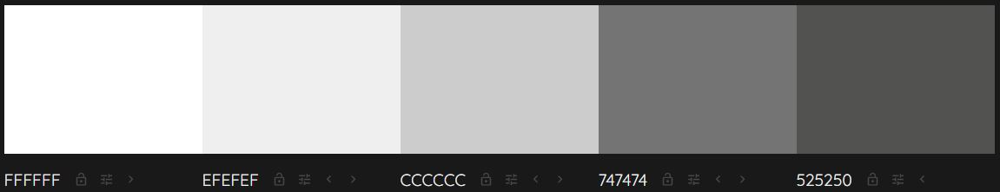
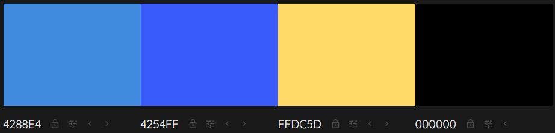

# Rock Paper Scissors Lizard Spock Game

[Click here to view the live site.](https://ashfoster.github.io/rps-lizard-spock/)

## Contents

## Overview

This is a web based rock paper scissors game which includes an additional lizard spock version. The user can play either game, both of which can be played on easy or hard difficulties. It has been designed to be fun, easy to pick up and play, and to be responsive across a range of popular devices.

## User Experience

The five planes of user experience were considered during the design phase of this website, which are all outlined below.

### Strategy Plane

Here, the user goals are considered and outlined with the aim of having a clear understanding of what thought process users of the site are likely to go through, and what they might expect from the website. 

The aim being to provide ideas for potential features for the website.

#### User Goals
  - __As a user I would like:__
      - to play a game based on chance.
      - to easily navigate across the website and have lots of feedback.
      - the website to be visually appealing and have no colour clashes.
      - to be able to read about the rules of the game.
      - to have a choice of difficulty levels.

### Scope Plane

All of the user goals outlined in the strategy plane all seem to be plausible for the first release of the website. For this reason there is not too much to consider in terms of further scope, and the plan is to implement all of the above mentioned goals and outcomes.

### Structure Plane

The idea is to keep the site all on one page, but to have a couple of sections - a main menu section and main area section - which are never visible at the same time. The site loads with the main menu section visible, which dissapears once a game has been selected; the main area section then being visible instead.

Both sections have headings above them, the main menu section saying Rock Paper Scissors Lizard Spock, and the main area section saying either Rock Paper Scissors or Lizard Spock depending on which game is being played.

The main menu section has two buttons: one for classic and the other for lizard spock, and also a toggle button to choose between easy or hard difficulties.

The main area section contains the following:
- After turn message - stating the outcome after each turn.
- A game animation area containing images of the player's and computer's hands. 
- A score area to keep track of the score.
- An icon area used by the player to select their hand.
- A button area containing two buttons: one to show the rules and the other to quit the game.

Originally the plan was to show the rules in a footer section at the bottom of the game screen. This can be seen in the [wireframes](#wireframes)) below. This idea was discarded during the development process in order to allow for more screen space for the game itself.

The rules button displays a modal with the rules for the game currently being played (classic or lizard).

The quit button displays a modal which asks the user to confirm whether or not they'd actually like to quit.

These are all outlined in more detail in the [Features](#features) section below.

### Skeleton Plane

#### Wireframes

Wireframes were created for mobiles, tablets, and desktops using [Balsamiq](https://balsamiq.com/).

For each device type there are three wireframes: Main Menu, Classic Screen, and Lizard Spock Screen.

Here are links to each of them:

- [Mobile - Main Menu](assets/wireframes/mobile-menu.pdf)
- [Mobile - Classic Screen](assets/wireframes/mobile-classic.pdf)
- [Mobile - Lizard Spock Screen](assets/wireframes/mobile-lizard.pdf)
- [Tablet - Main Menu](assets/wireframes/tablet-menu.pdf)
- [Tablet - Classic Screen](assets/wireframes/tablet-classic.pdf)
- [Tablet - Lizard Spock Screen](assets/wireframes/tablet-lizard.pdf)
- [Desktop - Main Menu](assets/wireframes/desktop-menu.pdf)
- [Desktop - Classic Screen](assets/wireframes/desktop-classic.pdf)
- [Desktop - Lizard Spock Screen](assets/wireframes/desktop-lizard.pdf)

### Surface Plane

#### Imagery

Images were only used to represent the player's and computer's hands, those being: rock, paper, scissors, lizard or spock. The chosen images used within the game came from [Tony Florida's](https://tonyflorida.com/rock-paper-scissors-lizard-spock-rules/) website, found with a google search. The images looked different from others I had seen; I liked this so decided to use them. I cropped them all, changed the angles, and made their backgrounds transparent.

#### Colour Scheme

The colour scheme used was partly influenced by the colour of the [images](#imagery) chosen which are yellow (#ffdc5d). I put this colour into [Adobe's Colour Wheel](https://color.adobe.com/create/color-wheel) and found a nice contrasting blue (#4254ff). This colour was used throughout the site including for the main menu buttons and difficulty toggle, the rules and quit buttons, the rules and quit modals, and the player and computer selections backgrounds. A lighter blue (#4288e4) was used as a border around all of these elements, too.

The heading text is coloured with a dark shade of grey (#525250) and has a border that is a slightly ligher shade of grey (#747474). This combo works well as it seems to make the text stand out without being overpowering.

The difficulty toggle background colour is a very light grey (#efefef) with a darker, but still light, grey border (#ccc). Although light, the grey still stands out against the white background, but doesn't take away the effect of the blue toggle selector in front of it. The text is white when covered by the blue toggle switch and black when not covered. The text colour changes when the toggle switches from one to the other.

The main background colour of the website is white. All text that sits on top of the white background - other than that already mentioned above - is black. The icons the user uses to select their hand are also black. Where the background is blue, the text is white.

All of the colours mentioned above can be seen in the following images:

#### Typography

For my typography choices I used [Google Fonts](https://fonts.google.com/?sort=popularity) which I sorted by popularity to give me an idea of some fonts that are likely to work well across a number of websites.

I then selected the ones that stood out the most to me. The fonts I chose are as follows:

Quantico - This is used for the H1 element that says Rock Paper Scissors.

Orbitron - This is used for the H1 element that says Lizard Spock. 

Poppins - This is used for all other text.

Each of them are of the font category Sans Serif which is the font used as a fallback if for any reason the specified font isn't available.

#### Iconography

[Font Awesome](https://fontawesome.com/) was used for the Rock, Paper, Scissors, Lizard and Spock icons that the user clicks on to make their selection each turn. The same icons are also shown on the rules modal to tell the user what each of them represents. These icons were chosen because they are simple, recognisable, and easy to work with.

## Features

### Existing Features

- __Heading__

  - The heading is at the top of the page and its state is dependent on which section is showing at the time. When the main menu section is showing it contains both "Rock Paper Scissors..." and "...Lizard Spock", but only shows the relevant heading when playing the classic version or the lizard spock version of the game.
  - Its purpose is to immediately let the user know that they're on a rock paper scissors lizard spock game website, and also to show them which version of the game they're currenlty playing when doing so.
  
  

- __Main Menu Area__

  - The main menu area contains two buttons: one to play the classic version and the other to play the lizard spock version of the game. It also contains a toggle selector switch which is used to select the difficulty of the game.
  - Its purpose is to allow the user to select which version of the game they'd like to play, and what difficulty level they'd like to play it on.

  

- __Main Area__

  - The main area contains all of the in game elements. Those being:
    1. After turn message - Initially says "Let's Go!", and then updates after each turn to say who won or if it is a draw. Its purpose is to let the player know the outcome of each turn.
    2. Game animation area - Contains images of the player's and computer's hands. Before the first turn of the game they're both an image of the rock symbol, and then once the player has selected their hand an animation is displayed before showing what hands were chosen. Its purpose it to provide the player with a visual representation similar to that of playing the game in real life.
    3. Scores area - This simply displays the score of the game, intially being 0-0. The aim here to is to allow the player to keep track of the score.
    4. Icon selection area - This area contains icons of the available hands that the player can choose for their turn. If playing classic only rock, paper, and scissors are shown, and when playing lizard then lizard and spock are also shown. The aim here is to make it easy for the player to play their selected hand.
    5. Button area - Two buttons are contained within this area. One that displays the rules of the game, and the other that allows the player to quit the game. Its aim is to allow the player to see the rules or to quit the game. 

  - The image below shows all of these areas from top to bottom.

    

- __Rules Modal__

  - The rules modal is displayed when the rules button is clicked on. It firstly shows what each symbol represents, and then shows which symbols beat which symbols.
  - The aim of the rules modal is to allow the player to see what the rules of the game are whether they're completely new to it or just need a refresh.

  

- __End Game Modal__

  - The end game modal is displayed when the player clicks on the quit button. It asks the player whether or not they actually want to quit. It has two buttons, yes and no.
  - The aim of the end game modal is to allow the player the chance not to quit in case they clicked on the quit button by accident or if they have changed their mind suddenly.

  

## Testing

### Validator Testing

- __HTML__

  - No errors or warnings were shown when put through the [W3C Markup Validation Service.](https://validator.w3.org/)

- __CSS__

  - No errors found when put through the [W3C CSS Validation Service - Jigsaw.](https://jigsaw.w3.org/css-validator/)

- __JavaScript__

  - No errors found when put through the [JSHint.](https://jshint.com/) Though there were many warnings about some things being available in ES6 (let, for of, template literal syntax, spread operator). With these being taught in the course I presume them to be ok. 
  - Another warning:
       "Functions declared within loops referencing an outer scoped variable may lead to confusing semantics. (showClassic, showLizardSpock, showRules, showEndModal, endGame, resetIcons, runGame)"
    This is referring to the for loop that adds event listeners to buttons. I don't see this as an issue because it is only run once - when the DOM has finished loading - and it simply adds functions to the buttons' click events.

### Performance Testing

I audited the website for mobile and desktop using Google Chrome's lighthouse feature. All scores were high. It might only be examing the landing page and not the in game page.

The final lighthouse scores are as follows:

  - Mobile

  

  - Desktop

  

I also used [WAVE Evaluation Tool](https://wave.webaim.org/) on the site and everything looks fine other than one contrast error issue. This relates to the difficulty toggle button. The labels which say easy and hard both have white text and a background colour of a light grey. Normally this would obviously cause a contrast issue, but in this case there is another div on top named "selector" which acts as the slider. This slider is blue and prevents the contrast issue from being present. When the slider moves the text changes to black which also prevents any contrast issues. I believe the evaluation tool hasn't picked this up.

### User Goals Testing

- _As a user I would like to play a game based on chance:_
    - The website meets this goal as the user is able to play two versions of a game based on chance each of which can be played on two difficulties.
- _As a user I would like to easily navigate across the website and have lots of feedback:_
    - The user can immedietely see their options upon the site loading. They can choose to play the classic version of the game or the lizard spock version of the game, with the difficulty setting clearly visible too. When in game there is clear feedback about the outcome of each turn, as well as the ability to look at the rules and to quit the game if desired. The scores update correctly, and the players selected icon is highlighted during each turn. An animation is played to see the outcome of each turn where an image of the player's and computer's hand are shown. Once either the player or computer has won, a mssage displaying who won is displayed.
- _As a user I would like the website to be visually appealing and have no colour clashes:_
    - The colours of the site are simple and visually appealing. There are no contrast issues. 
- _As a user I would like to be able to read about the rules of the game:_
    - When in game the user can click on the rules button which will display the rules of the game. The rules show what hand each icon represents, which hands beat which hands, and that it's first to 5 who wins.
- _As a user I would like to have a choice of difficulty levels:_
    - The user can choose between easy and hard difficulties upon landing on the site, and when they return to the main menu area after a game has finished or they have quit. On easy difficulty the computer's hand simply has a random outcome so in all cases the player can expect to win 50% of the time. On hard difficulty there is a pattern built in but still combined with an element of chance. If the pattern has been figured out and played against perfectly then the player can expect to win 60% of time when playing classic and 52% of the time when playing lizard spock. If the pattern is not known then the player can expect to win 45% of the time when playing classic and 46% of the time when playing lizard spock.

### Device and Browser Compatibility Testing

To test the site's compatibility across a range of devices I used [Responsinator](https://www.responsinator.com/) and went through all of the user and owner goals on each device it includes in both portrait and landscape modes. The devices included are as follows:

  - iPhone X
  - Pixel 2
  - iPhone 6-8
  - iPhone 6-8 Large Version
  - iPad

Chrome Dev Tools was also used to check the site's compatibility across a range of other devices also in both portrait and landscape modes. These devices include:

  - Ipad Pro
  - Galaxy Fold (which has a very narrow viewport of only 280px in portrait mode)

Actual mobile devices belonging to family and friends were also used for testing which include the following:

  - iPhone 7
  - Pixel 4
  - S10 Plus

A desktop monitor was also used for testing with a couple of different resolutions to check that the site remains to look and act as expected on larger screens. The resolutions were: 1366 x 768 and 1920 x 1080.

Google Chrome was the browser used for the majority of testing during the development process, but once development had neared an end some other browsers were used for testing to make sure the site had cross browser compatibility. The full list of browsers used for testing are as follows:

  - Chrome
  - Internet Explorer 11
  - Edge
  - Firefox

On all devices and browsers used for testing, whether real or simulated, the site looks and functions as expected, other than a small issue which is outlined in the [Bugs](#bugs) section below. Despite this, all of the user and owner goals are met to a standard I am happy with.

### Bugs

#### Fixed Bugs

- Initially when a game had been completed and another one had been started the images of the hands were the same as how the previous game had ended. This was easily fixed by resetting the images to the rock image within the endGame function.

- Another, similar issue occurred with the selection icons. Initially when a game had been completed and another one had been started the last icon selected by the player was still highlighted. This was similarly fixed by calling the resetIcons function within the endGame function.

- When first deployed I noticed that whenever a previously not selected hand was selected, its image wasn't loading quickly enough. Simply put, the image was changing shortly after the animation had finished rather than during. This was fixed by preloading all of the images within the function that is called once the DOM content has finished loading.

#### Unfixed Bugs

- When playing on iPhone 7 (I assume, but don't know, this applies to all iPhones) the rules and end game modals can't be closed when clicking outside of the modal content. The close button must be used in this case.

## Deployment

The site has been deployed to GitHub pages. The steps followed in doing so are as follows:
  1. Go to the project's GitHub repository.
  2. Select the Settings tab near the top of the page on the right hand side.
  3. Scroll down to the Pages section, or select Pages from the list of options running down the left hand side.
  4. Locate the Source section's drop-down menu and select the Master Branch (for some users it's Main rather than Master).
  5. This will cause the page to refresh, now displaying a ribbon indicating successful deployment with a link to the deployed site.

[Here's a link to the live site.](https://ashfoster.github.io/rps-lizard-spock/)